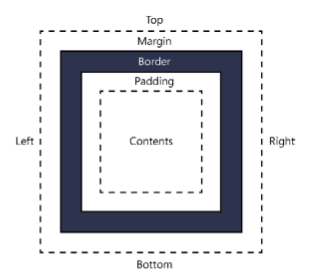

# Separation of structure and presentation
- HTML5 content and structure
- CSS3 presentation (format)

# Types of Stylesheet
- Inline
- Embedded
- External

# Style rules
Sequence of style rules

Syntax of style rule
```
selector {
    declaration1;
    declaration2;
    ...
}
```

Syntax of declaration
```
selector {
    property1 : value1;
    property1 : value1;
    ...
    propertyn : value1;
}
```
## Examples
```
p {
    font-size: large;
    font-family: sans-serif;
}
```

# Selectors
1. Element selector
```
button {
    background-color: white;
    color: gray;
}
```
2. Id selector
```
#btnSave {
    background-color: white;
    color: gray;
}
...
<button id="btnSave" ...> ...</button>
```
3. Class selector
```
.myStyle {
    background-color: white;
    color: gray;
}
...
<!DOCTYPE html>
<html lang="en" dir="ltr">
  <head>
    <meta charset="utf-8">
    <title></title>
  </head>
  <body>
    <input id='txtName' name='txtName' type='text' class='myStyle' />
    <button id='btnOk' class='myStyle'>Ok</button>
    <button id='btnSave'>Save</button>
    <button id='btnCancel' class='myStyle'>Cancel</button>
  </body>
</html>
```
4. Universal selector
```
\* {
  background-color: white;
  color: gray;
}
```
5. Descendant selector
```
li a {
    text-decoration: none;
}
div ol li a {
    text-decoration: none;
}
```
6. Child selector
```
li > a {
    text-decoration: none;
}
div > ol > li > a {
    text-decoration: none;
}
```
7. Grouping Selectors
```
button {
    background-color: white;
    color: gray;
}
p {
    background-color: white;
    color: gray;
}
```
```
button, p {
    background-color: white;
    color: gray;
}
```
8. Subsequent adjacent sibling selectors
```
div + h1 {
    background-color: yellow;
}
```
9. Subsequent sibling selectors

# Cascading
_Precedence to calculate the style of an element_
1. Important
2. Specificity
3. Textual order

_Evaluation order of style sheets_
1. Browser’s built-in style sheet
2. User's normal declarations in the user style sheet
3. Author's normal declarations in the author style sheet
4. Author's important declarations in the author style sheet
5. User's important declarations in the user style sheet

## Specificity
(a, b, c)
- a  Record the number of id attributes in the selector.
- b  Record the quantity of class selectors, attributes selectors, and pseudo classes.
- c  Record the quantity of element names in the selector.

Selector                  | a | b | c
:-------------------------|---|---|--
.                         | 0 | 0 | 0
li                        | 0 | 0 | 1
ol + li                   | 0 | 0 | 2
div ol + li               | 0 | 0 | 3
div.content               | 0 | 1 | 1
div.content + li          | 0 | 1 | 3
div.content + li.selected | 0 | 2 | 3
#main                     | 1 | 0 | 0
#main.selected            | 1 | 1 | 0
#main ul + li.selected    | 1 | 1 | 2

## Inheritance
```
body {
    font-size: x-large;
}
li:nth-child(even) {
    font-size: small;
}
li:nth-child(4) {
    font-size: inherit;
}
```

# Text properties
## Font family
- serif
- sans serif
- monospace
- cursive
- fantasy

```
h1 { font-family: arial, verdana, sans-serif; }
h1 { font-family: "times new roman", serif; }
h1 { font-family: "courier new", monospace; }
```

## Font size
- em (relative)
- px (absolute)
- pt
- pc
- in
- mm
- cm

```
    h1 { font-size: 12px; }
    h1 { font-size: 200%; }
    h1 { font-size: 1.2em; }
    h1 { font-size: 1in; }
    h1 { font-size: 2cm; }
```

# Box model

```
p {
    border: 10px;
    padding: 25px;
    margin: 15px;
    background-color: yellow;
    border-style: solid;
    border-color: green;
}
```

## Box parameters
```
p {
    border-bottom: 10px;
    border-right: 5px;
    border-left: 1px;
    border-top: 0px;
    padding: 25px;
    margin: 15px;
    background-color: yellow;
    border-style: solid;
    border-color: green;
}
```

Shorthand
```
padding: 1px 2px 3px 4px ;
```

```
padding: 5px 15px;
```

# Positioning `div` elements
